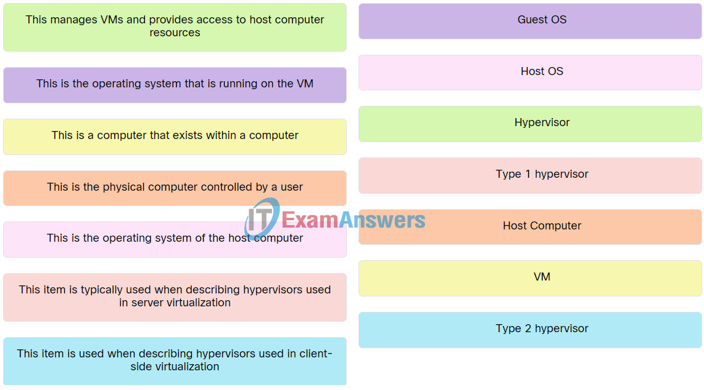

# Basics of Virtualization 🌐

> Outline:

- [x] Introduction to Virtualization 🖥️
- [x] Understanding Virtualization Terms 📘
- [x] Advantages of Virtualization 💡
- [x] Virtualization vs. Cloud ☁️
- [x] Introduction to VMware 💻
- [x] Different Products of VMware 🛠️

---

## Content

### What is Virtualization? 🖥️

- **What is Virtualization?**
  - Virtualization refers to the creation of virtual versions of physical resources, such as servers, storage devices, or networks. These virtual instances operate independently from the underlying hardware.

> More

### Understanding Virtualization Terms 📘

> **Virtualization Terms**

- **Bare-metal Server** 🏢

  - A physical server without an operating system.

- **Hypervisor** 💻

  - Software that creates and manages virtual machines. It can be either a host or virtual server.

- **Virtual Machine (VM)** 🖥️

  - A virtual instance of a computer that behaves like a physical machine.

- **Virtualization Manager** 🛠️

  - Tools used to manage virtual machines, such as vCenter and Oracle VM Manager.

- **Virtual Desktop** 🖥️

  - Virtual Desktop Infrastructure (VDI) provides a desktop environment from a centralized server.

- **P2V (Physical to Virtual)** 🔄

  - The process of converting a physical server into a virtual machine.

- **V2V (Virtual to Virtual)** 🔄

  - The process of converting one virtual machine to another virtual machine.

- **VM Template** 📄

  - A pre-configured virtual machine used as a blueprint for creating new VMs.

- **Snapshot** 📸

  - A point-in-time copy of the VM's state.

- **Clone or Cloning** 🔄
  - Creating an exact copy of a virtual machine.

> More

### Advantages of Virtualization 💡

> **Advantages**

- **Cost** 💵

  - Reduces hardware costs by running multiple VMs on a single physical server.

- **Real Estate** 🏢

  - Minimizes physical space requirements for servers.

- **Electricity** ⚡

  - Lowers energy consumption by reducing the number of physical servers.

- **Ease of Management** ⚙️

  - Simplifies the management of resources and configurations.

- **Redundancy (Lesser Downtime)** ⏱️

  - Enhances uptime with features like high availability and failover.

- **Faster Deployment of Machines** 🚀

  - Accelerates the setup of new virtual machines.

- **Resource Availability** 📈

  - Efficiently allocates resources among VMs based on demand.

- **Better Testing and Performance** 🧪

  - Facilitates testing and performance tuning in isolated environments.

- **Licensing** 📜
  - Optimizes software licensing through efficient use of resources.

### Virtualization vs. Cloud ☁️

- **Comparison Table**

| Aspect          | Virtualization                                    | Cloud                                                |
| --------------- | ------------------------------------------------- | ---------------------------------------------------- |
| **Definition**  | A software technology to create virtual resources | A remote service utilizing virtualization technology |
| **Location**    | On-premises                                       | Remote, often managed by a third party               |
| **Flexibility** | Limited to the physical hardware on-site          | Scalable, on-demand resources                        |
| **Management**  | Managed locally                                   | Managed by cloud provider                            |
| **Deployment**  | Requires physical infrastructure                  | No physical infrastructure needed                    |

- **Core Difference:**

  - **Virtualization** 🌐

    - A software technology that allows multiple virtual instances on a single physical machine.

  - **Cloud** ☁️

    - A remote service that utilizes virtualization technology to provide scalable and flexible resources.

  - **Private Cloud** 🔒
    - A type of cloud computing that can be implemented using a proprietary architecture, providing resources dedicated to a single organization.

> More

### Introduction to VMware 💻

- **What is VMware?**

  - VMware is a leading provider of virtualization and cloud computing solutions.

- **Brief Introduction to VMware:**

  - VMware offers a range of products and solutions for managing virtualized environments. Key components include:

  - **ESXi** (Hypervisor) 💻
    - A Type 1 hypervisor that runs directly on physical hardware to create and manage virtual machines.

- **Other Virtualization Companies** 🏢
  - Examples include Microsoft Hyper-V, Citrix Hypervisor, and Oracle VM.

### Different Products of VMware 🛠️

- **VMware Workstation Player** 💻

  - A desktop application that allows users to run multiple operating systems on a single physical machine.

- **VMware vSphere Hypervisor (ESXi)** 💻

  - A free, enterprise-grade hypervisor for creating and managing virtual machines.

- **VMware vSphere Client** 🖥️

  - A tool for managing and configuring VMware vSphere environments.

- **VMware vCenter** 🛠️
  - A centralized management tool for managing multiple ESXi hosts and virtual machines.

---
